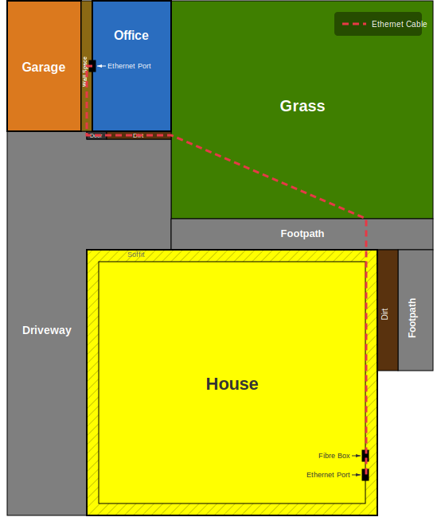
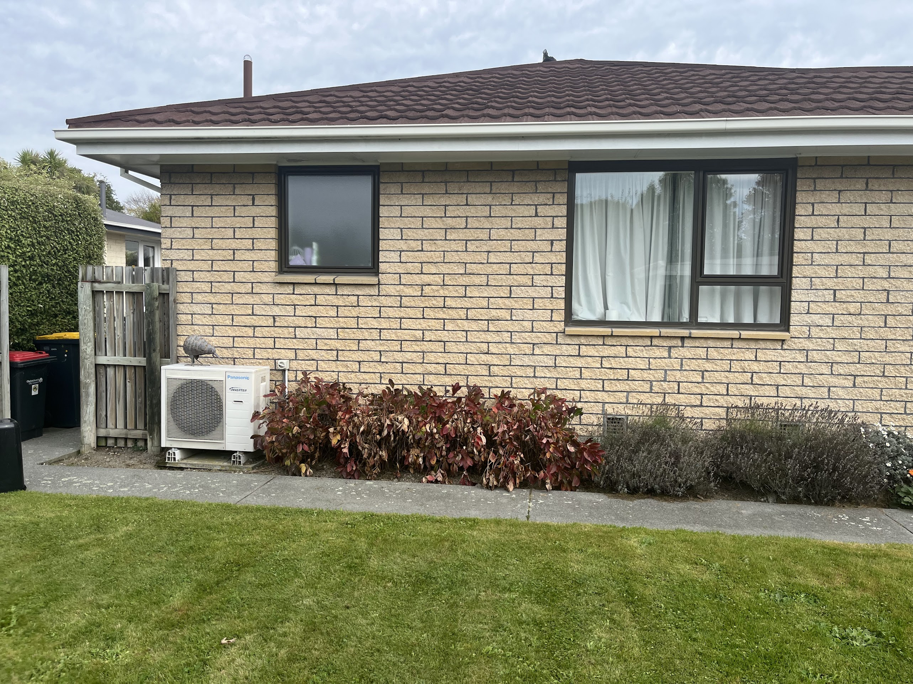
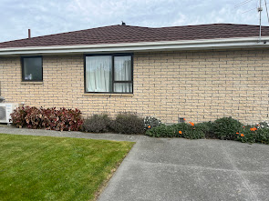
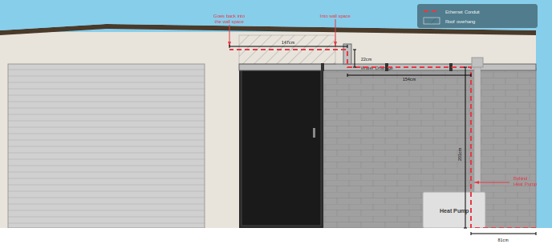
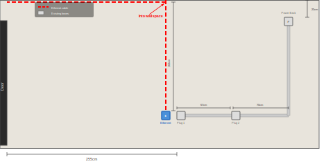
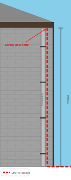
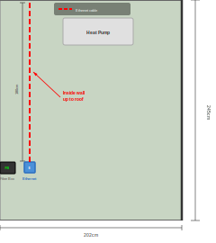

# Ethernet in office planning

## Diagrams

### Property Layout Top View

**Key dimensions (all to-scale, 1px = 1cm):**

- Office: 382cm × 500cm (outside)
- Garage: 265cm × 500cm (outside)
- Wall space: 21cm × 500cm
- Grass: 690cm × 1145cm
- House: 1093cm × 1210cm
- Paths: 80cm wide
- Soffit overhang: 40cm
- Dirt bed: 40cm (around house, outside soffit)

### Ethernet Path Top View

**Cable route segments:**

- Down wall space: 270cm
- Along office front: 393cm
- Down alongside driveway edge: 615cm
- Along horizontal path edge: 590cm
- Down house wall (path to ethernet port): 1125cm
- **Total: ≈2,993cm + slack**

#### Photos — Path

### Office Front Layout

**Key dimensions (working right to left from office corner):**

- Office blockwork: 265cm wide, 245cm high at corner
- Door space: 105cm wide, 255cm high
- Wall space: 21cm wide
- Garage: 265cm wide
- Water drainage pipe: at 200cm height
- HP pipe: 73cm from right corner
- Heat pump: 63cm from right corner, 78cm wide

### Office Front Ethernet Path

**Conduit route segments (right to left):**

- Ground to HP pipe: 81cm
- Up alongside HP pipe: 201cm
- Along water pipe: 154cm
- Up downpipe: 22cm
- Across to wall space: 147cm
- **Total front run: 605cm**

#### Photos — Office Front

### Office Inside Layout

**Key dimensions (wall space wall profile, door on left):**

- Wall shown: ~460cm wide, 215cm floor to ceiling
- Door to plug 1: 255cm
- Plug 1 to plug 2: 67cm
- Plug 2 to corner (going right): 70cm
- Vertical trunking up: 67cm
- Ceiling to power back box: 25cm
- All boxes: 12cm wide
- New ethernet box: 10cm left of plug 1

### Office Inside Ethernet Path

**Conduit route:**

- Cable comes through ceiling from wall space, drops 163cm straight down to new ethernet pattress box (10cm left of plug 1)

#### Photos — Office Inside

### House Downpipe Profile

**Key dimensions:**

- Wall height (ground to soffit): 272cm
- Downpipe to corner of house: 16cm
- Downpipe width: 8cm

### House Downpipe Ethernet Path

**Conduit route:**

- Comes out of soffit, runs down the right side of the downpipe (in the 16cm gap), then along the wall at ground level

#### Photos — House Downpipe

### House Inside Layout

**Key dimensions (fibre box wall profile):**

- Wall width shown: 202cm (bottom-right corner of house to fibre box)
- Floor to ceiling height: 245cm
- Fibre box: 17cm wide × 13cm high, 180cm from ceiling to top
- Cable wall entry point: aligned with fibre box, 10cm away

### House Inside Ethernet Path

**Conduit route:**

- Cable comes through ceiling from soffit/wall space, drops down to new ethernet port 10cm to the right of the fibre box

#### Photos — House Inside

## To purchase

- For office:
  - 1x Single-Gang Surface Mount Box (Pattress Box): Make sure the depth matches your wall plate covers.
  - 1x Wall Plate Cover: To screw onto the box.
  - 2x Toolless Cat6 Jack: (If you’re sticking to the "one cable" plan, you only need one here, but having a spare is fine).
  - 3–4m Mini Trunking: (Self-adhesive).
  - 1x 5-Port Gigabit Switch: The "brain" of the office desk.
  - 3x Cat6 Patch Leads: One for Wall-to-Switch, two for your laptop docks.
  - Fish Tape - For feeding the cable in the wall in the garage
- For inside
  - 1x Double RJ45 Wall Plate (Faceplate).
  - 1x Mounting "C-Clip" or Bracket: Since you are putting a plate on a plasterboard wall, you need the little metal bracket that sits behind the wall for the plate to screw into.
  - 2x Toolless Cat6 Jacks: (One for your active line, one to fill the second hole as a spare).
  - 2x Cat6 Patch Leads (1m): One for Fibre-to-Deco, one for Deco-to-Wall.
- For outside (the run)
  - Cat6 Outdoor-Rated Ethernet Cable: (Measure your TBCs and add 5 meters for "oops" room).
  - 20mm Electrical Conduit: (Rigid grey pipe for the wall drop and underground).
  - 20mm Conduit Saddles: (To fix the pipe to the brick/wood).
  - 20mm Conduit Fittings: Sweep Bends
  - 90-degree Bends/Elbows: To go from vertical wall to horizontal ground.
  - Conduit Glue (PVC Cement): To make the joints waterproof.
  - Silicone Sealant: To seal the holes in the soffit and the office wall.
  - 1x 20mm Conduit Junction Box (Surface Mount)
  - Or 1x 20mm Female Adaptor
- Tools:
  - "Spade Bit" or "Hole Saw" (usually 20mm or 25mm)

## Raw Measurements Reference

- House
  - Path along side — 500cm
  - Path to kitchen window — 450cm
  - Kitchen window to Browne box — 110cm
  - Ground to soffit — 272cm
  - From downpipe to path — 105cm
  - Downpipe to corner — 16cm
  - Downpipe width — 8cm
  - Soffit overhang — 40cm
  - Dirt bed depth — 80cm
- Path
  - Width — 80cm
  - Depth (into ground) — 10cm
- Grass
  - Along house — 690cm
  - To office — 645cm
- Office (outside)
  - Width (corner to wall space) — 382cm
  - Garage width (wall space to corner) — 265cm
  - Wall space width — 21cm
  - Height at corner — 245cm
  - Height above door — 255cm
  - Door space width — 105cm
  - Blockwork (corner to door space) — 265cm
  - Water drainage pipe height — 200cm
  - HP pipe from corner — 73cm
  - Heat pump from corner — 63cm
  - Heat pump width — 78cm
  - Overhang past door space — 15cm
  - Up to water pipes — 205cm
  - Up pipe to above door — 30cm
- Office (inside)
  - Wall space depth into room — 270cm
  - Width — 365cm
  - Depth — 500cm
  - Wall thickness — ~25cm
  - Floor to ceiling — 215cm
  - Ceiling to top of power box — 25cm
  - Ceiling to top of ethernet port box — 163cm
- House (inside)
  - Floor to ceiling — 245cm
  - Corner to fibre box — 202cm
  - Fibre box width — 17cm
  - Fibre box height — 13cm
  - Ceiling to top of fibre box — 180cm
  - Fibre box to wall entry point — 10cm

---

## Diagram Technical Reference

These shape dimension tables are used for maintaining the to-scale SVG diagrams (1px = 1cm).

### Bird's-Eye View Shapes

| Shape | Width | Depth | Notes |
|-------|-------|-------|-------|
| Office | 382cm | 500cm | Outside measurement |
| Garage | 265cm | 500cm | Outside measurement |
| Wall Space | 21cm | 500cm | Between garage and office |
| Driveway | 265cm | 645cm | Same width as garage |
| Dirt (below office) | 382cm | 60cm | Estimated |
| Horizontal Path | 690cm | 80cm | Same width as grass |
| Vertical Path | 80cm | 1935cm | 645cm above + 80cm horiz path + 1210cm house side |
| Grass | 690cm | 1145cm | 645cm gap + 500cm office depth, extends alongside office |
| House | 1093cm | 1210cm | Width: office(382)+wall(21)+grass(690). Depth: path(500)+window(450)+fibrebox(110)+end(150) |
| Soffit | 40cm | 40cm | Overhang around house |
| Dirt (around house) | 40cm | 1210cm | Dirt bed around house, outside soffit |

### Office Front Elevation Shapes

Working right to left from office corner. Diagram ends at garage door left edge.

| Shape | X from right | Width | Height | Notes |
|-------|-------------|-------|--------|-------|
| Office blockwork | 0 | 265cm | 245cm | Corner to door space edge |
| Heat pump | 1cm | 78cm | 55cm | On ground against wall |
| HP Pipe | 80cm | 8cm | 205cm | From ground up to water pipe |
| HP Pipe box | 78cm | 16cm | 14cm | Junction at top of pipe |
| Water drainage pipe | 80cm | 302cm | 12cm | HP pipe across to wall space (at 200cm height) |
| Downpipe (vertical) | 252cm | 10cm | 30cm | From water pipe up into roof |
| Door space | 265cm | 105cm | 255cm | Full door opening |
| Overhang hatch | 265cm | 105cm | 55cm | Above door, under roof |
| Wall space | 382cm | 21cm | 245cm | Between office and garage |
| Garage wall | 403cm | 265cm | 245cm | Only showing to door edge |
| Cream soffit | 0 | full | ~50cm | Strip above blockwork |
| Roof/fascia | 0 | full | ~15cm | Slopes up to garage peak |

### House Downpipe Profile Shapes

Front elevation looking at the house wall where the downpipe is. Right side is the corner of the house.

| Shape | X from corner (right) | Width | Height | Notes |
|-------|----------------------|-------|--------|-------|
| Wall (blockwork) | 0 | ~100cm shown | 272cm | House wall face section |
| Fascia/roof edge | 0 | full width | 12cm | Eaves edge above wall |
| Downpipe | 16cm | 8cm | ~268cm | From soffit down to shoe fitting |
| Pipe shoe fitting | ~20cm | 14cm | 8cm | Elbow/bend at pipe base |
| Pipe brackets | on pipe | 12cm | 2.5cm | Clips holding pipe to wall, ~70cm apart |
| Ground/dirt | 0 | full width | visible | Ground level at wall base |
| Corner edge | 0 | — | 272cm | Bold line marking house corner |
