# Fibre to office planning

## Diagrams

> **Note:** All diagrams in this project are SVG and drawn to scale, where **1px = 1cm**.

### Property Layout Top View

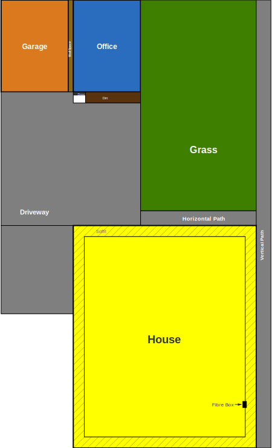

**Key dimensions (all to-scale, 1px = 1cm):**

- Office: 365cm × 500cm (outside)
- Garage: 373cm × 500cm (outside)
- Wall space: 17cm × 500cm
- Office dirt bed: 78cm (below office, no soffit)
- Grass: 680cm × 619cm
- House: 1080cm × 1168cm
- Driveway (vertical): 301cm wide
- Paths: 80cm wide
- House soffit overhang: 50cm (within dirt bed)
- House dirt bed: 80cm (around house, includes soffit)

**Horizontal totals:**
- Office level: Garage(373) + Wall space(17) + Office(365) + Grass(680) + Vertical path(80) = 1515cm
- House level: Driveway(301) + House(1080) + Dirt bed(80) + Vertical path(80) = 1541cm

**Vertical total:**
- Office(500) + Dirt(78) + Grass(619) + H-path(80) + House dirt(80) + House(1168) = 2525cm

### Fibre Path Top View

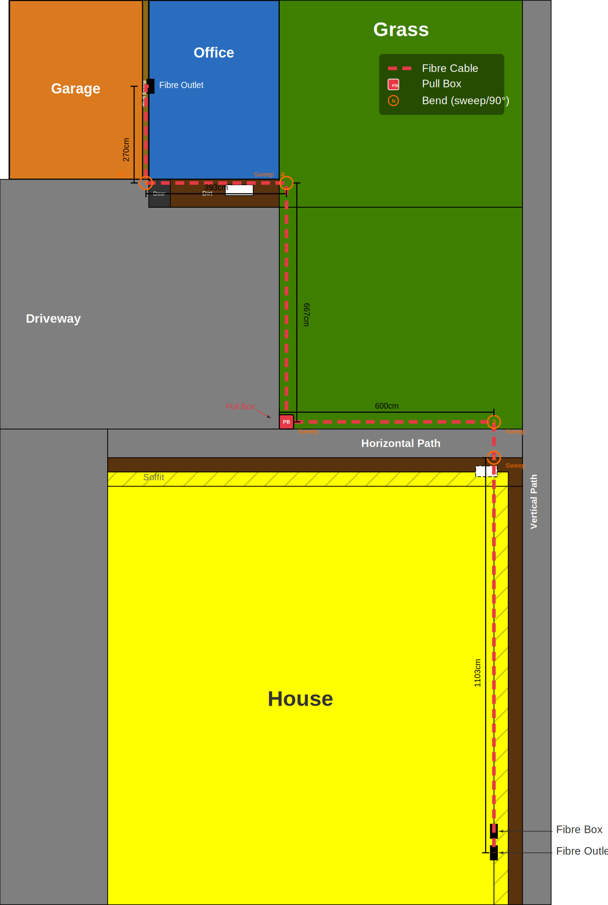

**Cable route segments:**

- House inside (bare fibre): ~65cm up through wall into ceiling + ~560cm across roof space (to soffit hole)
- House downpipe (conduit): 275cm down alongside downpipe
- House ground to path (conduit, buried 30cm deep): ~186cm (26cm corner + 80cm dirt + 80cm path)
- Under path (conduit, buried below path base): ~80cm
- Alongside driveway edge (conduit, buried 30cm deep): ~667cm
- **Pull box** at corner where driveway meets horizontal path (weatherproof junction box, buried)
- Alongside horizontal path edge (conduit, buried 30cm deep): ~600cm
- Office front (conduit, P-clipped to wall): 673cm (325cm up corner + 348cm along top to wall space)
- Office wall space (bare fibre): 270cm down inside wall
- Office inside (bare fibre in trunking): 163cm ceiling to surface box
- **Total: ~3,539cm (~35m) + slack**

**Bends in the run (5 total):**

1. House downpipe base → into ground towards path (sweep bend)
2. Underground turn → parallel with horizontal path (sweep bend)
3. Turn towards office along driveway edge (sweep bend) — **pull box here**
4. Driveway edge → up office wall (sweep bend)
5. Top of office wall → left along top into wall space (sweep bend)

Conduit goes straight up the office corner, turns left along the top and into the wall space. **Pull box** at bend 3 splits the run into two segments (2 bends + 3 bends). Use cable-pulling lubricant at each segment.

### House Inside Layout

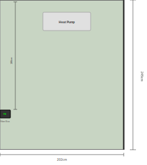

**Key dimensions (fibre box wall profile):**

- Wall width shown: 203cm (bottom-right corner of house to fibre box)
- Floor to ceiling height: 244cm
- Fibre box: 17cm wide × 13cm high, 181cm from ceiling to top
- Heat pump: 50cm from fibre box, 78cm wide × 29cm high, 18cm from ceiling
- Cable wall entry point: aligned with fibre box, 10cm away

### House Inside Fibre Path

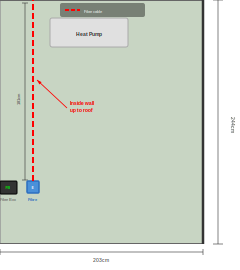

**Route:**

- Fibre comes through ceiling from soffit/wall space, drops down through brush plate 10cm to the right of the fibre box, plugs into media converter

#### Photos — House Inside

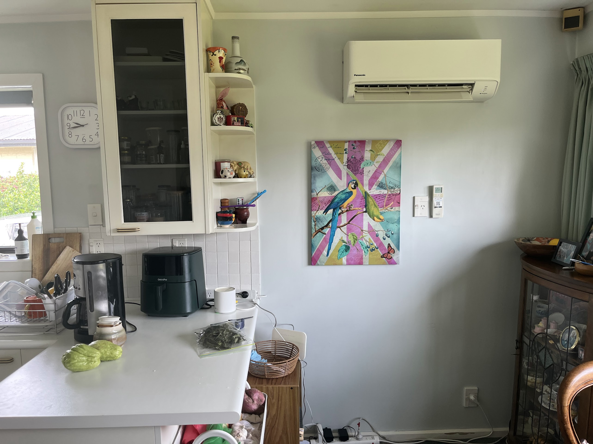

### House Downpipe Profile

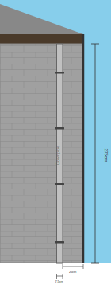

**Key dimensions:**

- Wall height (ground to soffit): 275cm
- Downpipe to corner of house: 26cm
- Downpipe width: 7.5cm
- Soffit overhang: 50cm

### House Downpipe Fibre Path

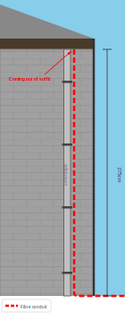

**Conduit route:**

- Comes out of soffit, runs down the right side of the downpipe (in the 26cm gap), then along the wall at ground level

#### Photos — House Downpipe

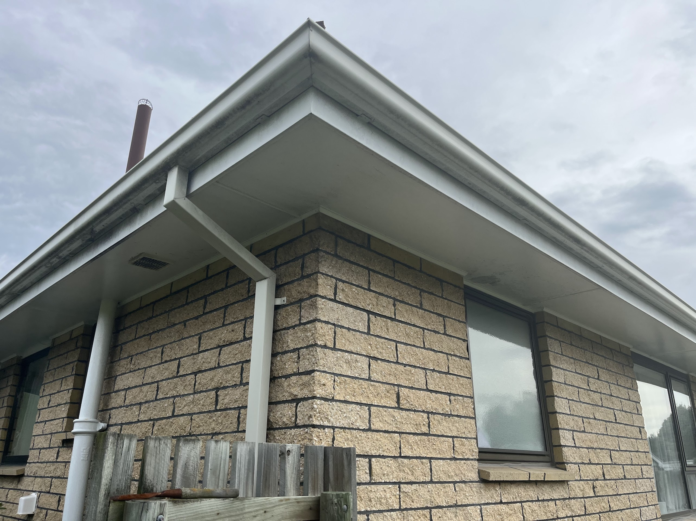

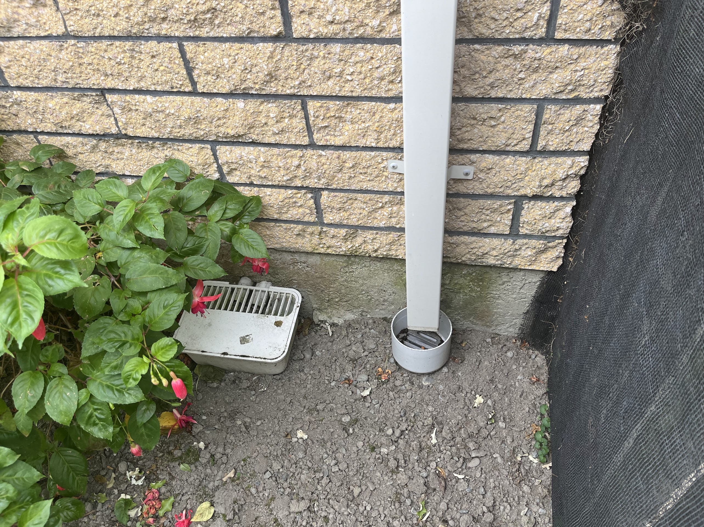

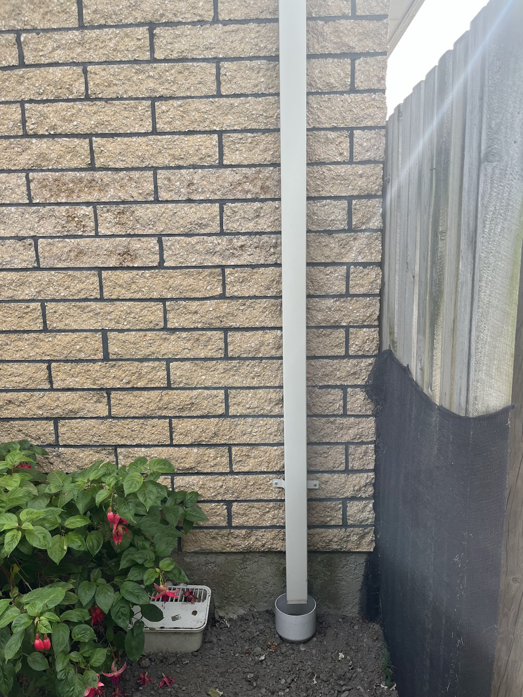

### Office Front Layout

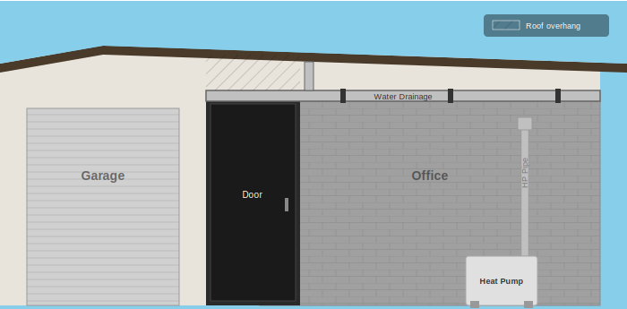

**Key dimensions (working right to left from office corner):**

- Office blockwork: 227cm wide, 325cm high at corner
- Door space: 104cm wide, 265cm high
- Wall space: 17cm wide
- Garage: 260cm wide (door width)
- Water drainage pipe: at 200cm height
- HP pipe: 72cm from right corner
- Heat pump: 62cm from right corner, 78cm wide

### Office Front Fibre Path

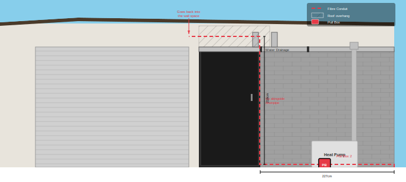

**Conduit route segments (right to left):**

- Up office corner to water pipe: 200cm
- Along water pipe: 155cm
- Up downpipe into overhang: 22cm
- Into wall space
- **Total front run: 377cm**

#### Photos — Office Front

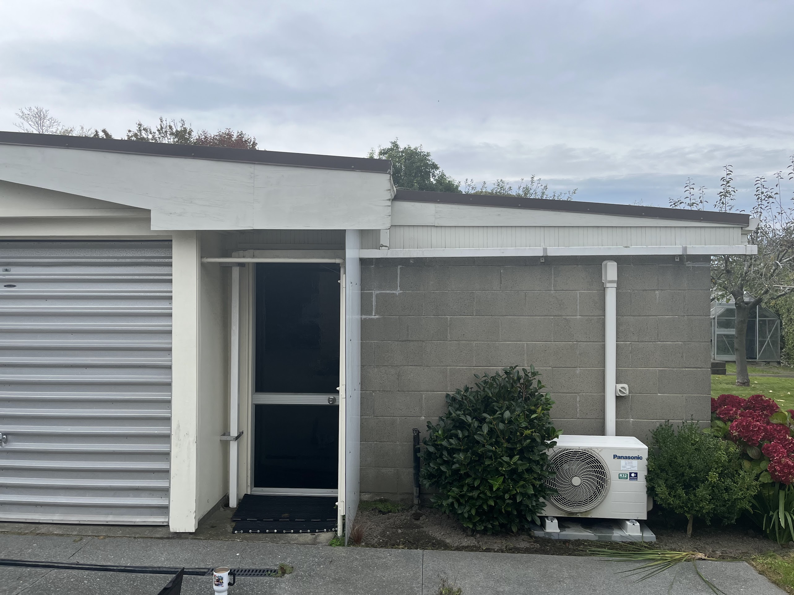

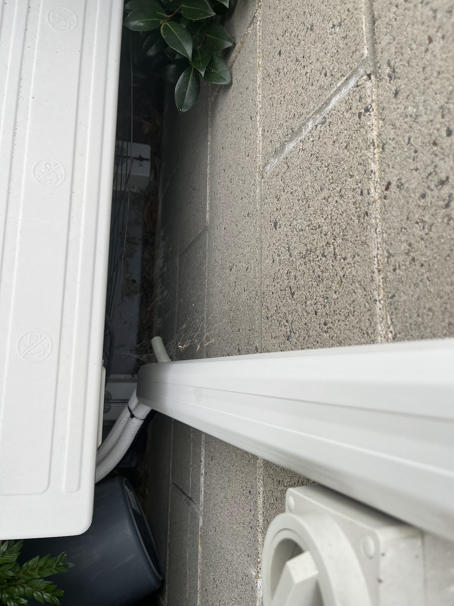

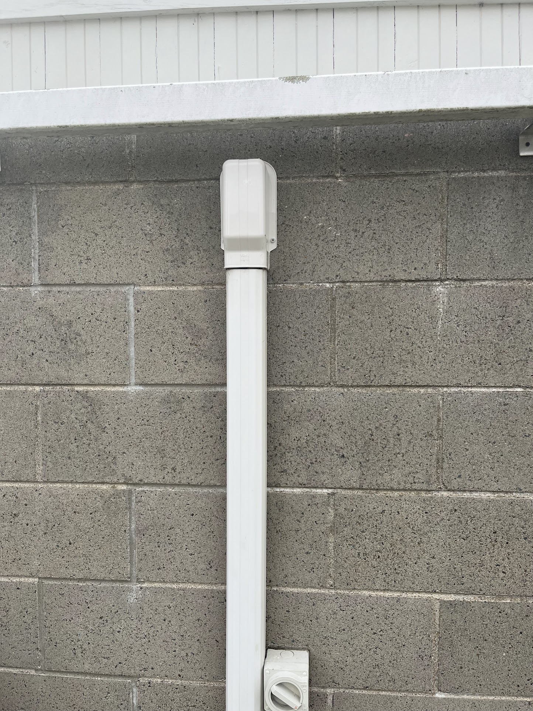

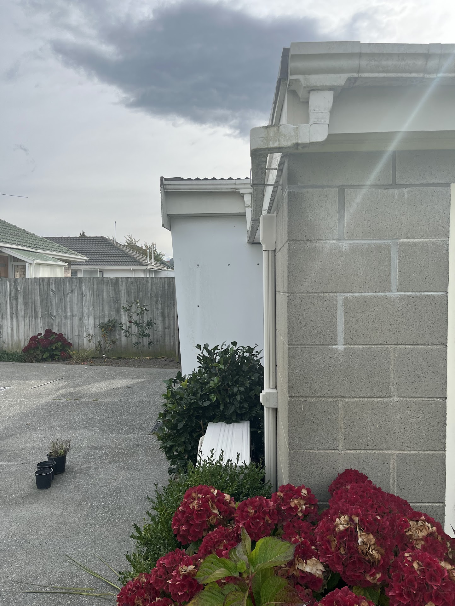

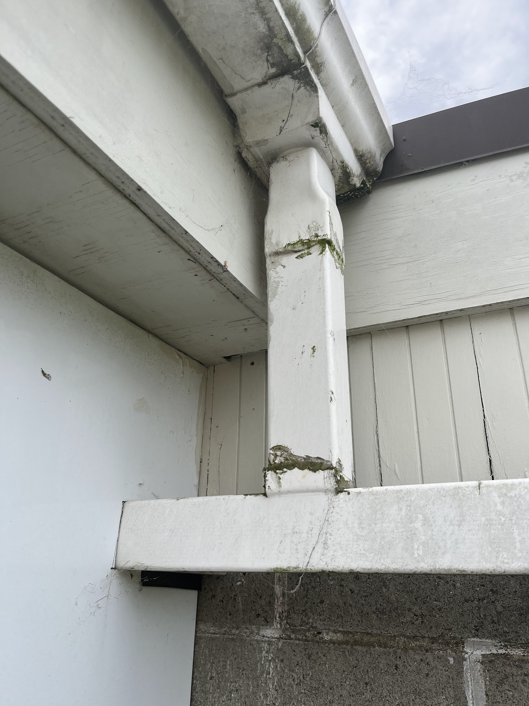

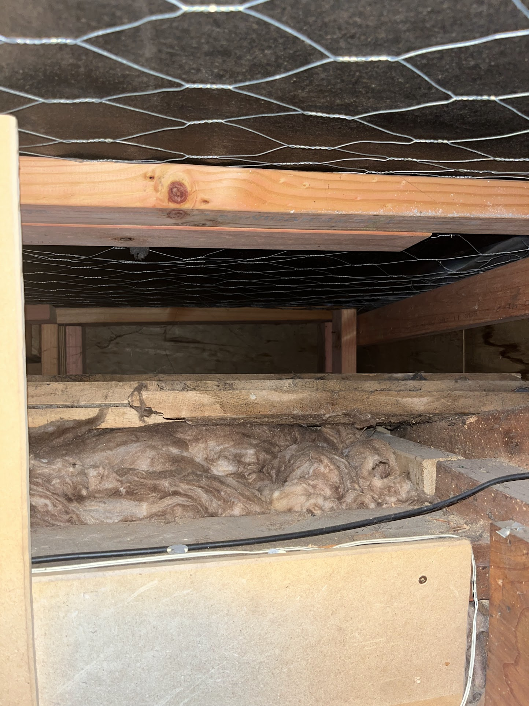

### Office Inside Layout

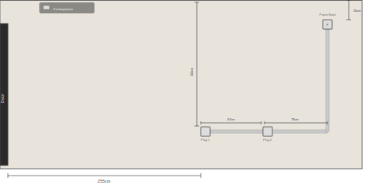

**Key dimensions (wall space wall profile, door on left):**

- Wall shown: ~460cm wide, 215cm floor to ceiling
- Door to plug 1: 255cm
- Plug 1 to plug 2: 67cm
- Plug 2 to corner (going right): 70cm
- Vertical trunking up: 67cm
- Ceiling to power back box: 25cm
- All boxes: 12cm wide
- New fibre outlet: 10cm left of plug 1

### Office Inside Fibre Path

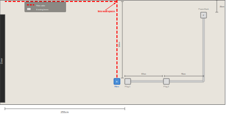

**Route:**

- Fibre comes through ceiling from wall space, drops 163cm straight down through brush plate (10cm left of plug 1), plugs into media converter/switch below

#### Photos — Office Inside

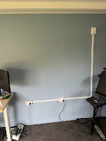

## To Purchase

### House Inside

| Item | Qty | Store | Price | Link |
|------|-----|-------|-------|------|
| Brush Plate Wall Cover | 1 | Bunnings | ~$10.71 | [Deta Brush Wall Cover](https://www.bunnings.co.nz/deta-white-brush-wall-cover-plate_p0322381) |
| Mounting C-Clip/Bracket (plasterboard) | 1 | Bunnings | ~$3.32 | [Deta Plaster Clip](https://www.bunnings.co.nz/deta-plaster-clip-mounting-bracket-single-pack_p0310775) |
| TP-Link MC220L Media Converter | 1 | PB Tech | ~$33 | [MC220L](https://www.pbtech.co.nz/product/NETTPL0220/TP-Link-MC220L-Gigabit-Media-Converter---Fiber-SFP) |
| MikroTik S-31DLC20D SFP Module (Singlemode) | 1 | PB Tech | ~$45 | [S-31DLC20D](https://www.pbtech.co.nz/product/NETMKT1065/MikroTik-S-31DLC20D-SFP-module-125G-SM-20km-1310nm) |
| Cat6 Patch Lead 1m | 1 | PB Tech | ~$5 | [Dynamix Cat6 1m](https://www.pbtech.co.nz/product/ITPCAQ601BL/Dynamix-PLE-C6A-1-Cat6-RJ45-Patch-Lead---1m---Blue) |

### Outside Run

| Item | Qty | Store | Price | Link |
|------|-----|-------|-------|------|
| Singlemode Fibre Cable 50m (LC-LC, pre-terminated) | 2 | Amazon AU | ~$60 ea | [LC-LC 50m OS2](https://www.amazon.com.au/Multimode-Singlemode-Fiber-Cable-164ft/dp/B07DPKBLVS) |
| Weatherproof Pull Box (Deta 108×108×76mm Adaptable Box) | 1 | Bunnings | ~$17.70 | [Deta Adaptable Box](https://www.bunnings.co.nz/deta-108-x-108-x-76mm-adaptable-box-108-x-108-x-76mm_p4330859) |
| 20mm Conduit Adaptors with Lock Ring (for pull box) | 2 | Bunnings | ~$0.48 ea | [Deta 20mm Adaptor](https://www.bunnings.co.nz/deta-20mm-grey-pvc-conduit-adaptor-with-lock-ring-single-pack_p0963443) |
| 20mm Rigid Conduit (4m lengths) | 10 | Mitre 10 | ~$14.68 ea | [Marley 20mm x 4m](https://www.mitre10.co.nz/shop/marley-arma-rigid-conduit-pipe-20mm-x-4m-grey/p/333734) |
| 20mm Conduit Couplers/Joiners | 10 | Mitre 10 | ~$1 ea | [Marley Coupling](https://www.mitre10.co.nz/shop/marley-conduit-plain-coupling-20mm-grey/p/103097) |
| 20mm Conduit Sweep Bends | 7 | Mitre 10 | ~$6.28 ea | [Marley Sweep Bend](https://www.mitre10.co.nz/shop/marley-conduit-90-degree-sweep-bend-20mm-grey/p/103200) |
| 20mm PVC Conduit Mounting Clips | 20 | Bunnings | ~$0.36 ea | [Deta 20mm Clip](https://www.bunnings.co.nz/deta-20mm-grey-pvc-conduit-mounting-clip-single-pack_p0963492) |
| Conduit Glue (PVC Cement) | 1 | Mitre 10 | ~$12 | [ADOS PVC Cement 125ml](https://www.mitre10.co.nz/shop/ados-pvc-pipe-cement-clear-pvc-adhesive-125ml-clear/p/370313) |
| Silicone Sealant (clear) | 1 | Mitre 10 | ~$11 | [Gorilla Silicone 300ml](https://www.mitre10.co.nz/shop/gorilla-plumbers-silicone-sealant-300ml-clear/p/104833) |
| 20mm Conduit Bushes/Grommets | 10 | TBC | ~$1 ea | Not found online — ask in-store at Mitre 10 or try [NZ Fasteners](https://nzfasteners.co.nz/collections/grommets-ee) |
| Cable Pulling Lubricant | 1 | Mitre 10 | ~$15 | Ask in-store — electrical section, or search for wire-pulling gel/lube |

### Office Inside

| Item | Qty | Store | Price | Link |
|------|-----|-------|-------|------|
| Brush Plate Surface Box | 1 | Bunnings | ~$10.71 | [Deta Brush Wall Cover](https://www.bunnings.co.nz/deta-white-brush-wall-cover-plate_p0322381) |
| Mini Trunking 25x16mm (3m, cut to 2m) | 1 | Mitre 10 | ~$8 | [Marley Mini Trunking](https://www.mitre10.co.nz/shop/marley-mini-trunking-3m-25x16mm-white/p/103197) |
| MikroTik CSS106-5G-1S Switch (5× Ethernet + 1× SFP) | 1 | PB Tech | ~$107 | [RB260GS/CSS106](https://www.pbtech.co.nz/product/NETMKT1001/MikroTik-RB260GS-5-Port-Gigabit-Managed-Switch-wit) |
| MikroTik S-31DLC20D SFP Module (Singlemode) | 1 | PB Tech | ~$45 | [S-31DLC20D](https://www.pbtech.co.nz/product/NETMKT1065/MikroTik-S-31DLC20D-SFP-module-125G-SM-20km-1310nm) |
| Cat6 Patch Leads 1m | 3 | PB Tech | ~$5 ea | [Dynamix Cat6 1m](https://www.pbtech.co.nz/product/ITPCAQ601BL/Dynamix-PLE-C6A-1-Cat6-RJ45-Patch-Lead---1m---Blue) |

### Tools

| Item | Qty | Store | Price | Link |
|------|-----|-------|-------|------|
| Drywall/Jab Saw | 1 | Bunnings | ~$6 | [Craftright 150mm](https://www.bunnings.co.nz/craftright-jab-saw-150mm_p5710163) |
| 25mm Spade Bit | 1 | Mitre 10 | ~$5.45 | [Spade Bits section](https://www.mitre10.co.nz/shop/tools-equipment/power-tool-accessories/drilling/drilling/flat-spade-bits/c/RC27910) |
| Fish Tape 30m | 1 | PB Tech | ~$49 | [Goldtool Fish Tape 30m](https://www.pbtech.co.nz/product/TOLGOL13030200/Goldtool-Fish-Tape-30m---Strong-High-Carbon-Steel) |
| Nylon Pull String 30m+ | 1 | Bunnings | ~$8 | Search in-store — smooth nylon rope/string |
| Cable Pulling Sock/Grip | 1 | Online | ~$15 | [Fruugo NZ](https://www.fruugo.co.nz/anti-slip-mesh-cable-puller-grips-flexible-multi-size-wire-pulling-socks-lassos-for-electricians/p-426325325-895339223) |
| Split Loom Tubing 3m (16mm) | 2 | Bunnings | ~$13 ea | [Deta 16mm Split Tubing](https://www.bunnings.co.nz/deta-3m-16mm-corrugated-split-tubing_p0381015) |
| Hacksaw | 1 | Mitre 10 | ~$15 | Search in-store |
| Cable Clips 6-8mm (pack) | 1 | Mitre 10 | ~$5 | [HPM Cable Clips](https://www.mitre10.co.nz/shop/hpm-cable-clips/p/388902) |
| Duct Tape | 1 | Mitre 10 | ~$8 | Available in-store |
| Safety Glasses | 1 | Mitre 10 | ~$5 | Available in-store |
| Wall Filler (Polyfilla) | 1 | Mitre 10 | ~$8 | Available in-store |

### Items to find in-store (no online link found)

- **20mm Conduit Bushes/Grommets** — ask at Mitre 10 or Bunnings electrical section, or [NZ Fasteners](https://nzfasteners.co.nz/collections/grommets-ee)
- **Nylon Pull String** — smooth nylon rope/string 30m+, check Bunnings rope section

### Estimated Total: ~$829 (~$679 materials + ~$150 tools)

## Raw Measurements Reference

- House
  - Path along side — 500cm
  - Path to kitchen window — 450cm
  - Kitchen window to Browne box — 110cm
  - Ground to soffit — 275cm
  - From downpipe to path — 186cm
  - Downpipe to corner — 26cm
  - Downpipe width — 7.5cm
  - Soffit overhang — 50cm
  - Dirt bed depth — 80cm
- Path
  - Width — 80cm
  - Depth (into ground) — 10cm
- Grass
  - Along house — 690cm
  - To office — 645cm
- Office (outside)
  - Width (corner to wall space) — 365cm
  - Garage width (wall space to corner) — 260cm
  - Wall space width — 17cm
  - Height at corner — 325cm
  - Height above door — 265cm
  - Door space width — 104cm
  - Blockwork (corner to door space) — 227cm
  - Water drainage pipe height — 200cm
  - HP pipe from corner — 72cm
  - Heat pump from corner — 62cm
  - Heat pump width — 78cm
  - Overhang past door space — 15cm
  - Up to water pipes — 205cm
  - Up pipe to above door — 49cm
- Office (inside)
  - Wall space depth into room — 270cm
  - Width — 365cm
  - Depth — 500cm
  - Wall thickness — ~25cm
  - Floor to ceiling — 215cm
  - Ceiling to top of power box — 25cm
  - Ceiling to top of fibre outlet box — 163cm
- House (inside)
  - Floor to ceiling — 244cm
  - Corner to fibre box — 203cm
  - Fibre box width — 17cm
  - Fibre box height — 13cm
  - Ceiling to top of fibre box — 181cm
  - Fibre box to wall entry point — 10cm
  - Heat pump: 50cm from left edge of fibre box, 78cm wide, 29cm tall, 18cm from ceiling

---

## Diagram Technical Reference

These shape dimension tables are used for maintaining the to-scale SVG diagrams (1px = 1cm).

### Bird's-Eye View Shapes

| Shape | Width | Depth | Notes |
|-------|-------|-------|-------|
| Office | 365cm | 500cm | Outside measurement |
| Garage | 373cm | 500cm | Outside measurement |
| Wall Space | 17cm | 500cm | Between garage and office |
| Driveway (vertical) | 301cm | 2025cm | Runs from bottom of garage to bottom of house |
| Dirt (below office) | 365cm | 78cm | No soffit on office |
| Horizontal Path | 680cm | 80cm | Same width as grass |
| Vertical Path | 80cm | ~2525cm | Full height of diagram |
| Grass | 680cm | 619cm | Between office dirt and horizontal path |
| House | 1080cm | 1168cm | Sits between driveway and dirt bed |
| Soffit | 50cm | 50cm | Overhang around house, within dirt bed |
| Dirt (around house) | 80cm | 80cm | Top and right sides of house only. Left side flush with driveway, bottom is edge of diagram |

### Office Front Elevation Shapes

Working right to left from office corner. Diagram ends at garage door left edge.

| Shape | X from right | Width | Height | Notes |
|-------|-------------|-------|--------|-------|
| Office blockwork | 0 | 227cm | 325cm | Corner to door space edge |
| Heat pump | 62cm | 78cm | 55cm | On ground against wall |
| HP Pipe | 72cm | 8cm | 200cm | From ground up to water pipe |
| HP Pipe box | 72cm | 16cm | 14cm | Junction at top of pipe |
| Water drainage pipe | 72cm | 331cm | 8cm | HP pipe across to wall space (at 200cm height) |
| Downpipe (vertical) | 227cm | 10cm | 49cm | From water pipe up into roof |
| Door space | 227cm | 104cm | 265cm | Full door opening |
| Overhang hatch | 227cm | 120cm | 36cm | Above door, under roof |
| Wall space | 365cm | 17cm | 325cm | Between office and garage |
| Garage wall | 382cm | 260cm | 325cm | Only showing to door edge |
| Cream soffit | 0 | full | ~50cm | Strip above blockwork |
| Roof/fascia | 0 | full | ~15cm | Slopes up to garage peak |

### House Downpipe Profile Shapes

Front elevation looking at the house wall where the downpipe is. Right side is the corner of the house.

| Shape | X from corner (right) | Width | Height | Notes |
|-------|----------------------|-------|--------|-------|
| Wall (blockwork) | 0 | ~100cm shown | 275cm | House wall face section |
| Fascia/roof edge | 0 | full width | 12cm | Eaves edge above wall |
| Downpipe | 26cm | 7.5cm | ~271cm | From soffit down to shoe fitting |
| Pipe shoe fitting | ~30cm | 14cm | 8cm | Elbow/bend at pipe base |
| Pipe brackets | on pipe | 11.5cm | 2.5cm | Clips holding pipe to wall, ~70cm apart |
| Ground/dirt | 0 | full width | visible | Ground level at wall base |
| Corner edge | 0 | — | 275cm | Bold line marking house corner |

---

## Step-by-Step Installation

### Phase 1: House Inside

**What you're doing:** Cutting a hole in the wall next to the fibre box, mounting a brush plate, and drilling up into the ceiling so the fibre cable can get from the roof space down to the media converter.

**Tools needed:** Jab saw, 25mm spade bit, drill, pencil, spirit level

**Parts needed:** Brush plate, mounting C-clip/bracket

**Steps:**

1. **Mark the brush plate position.** Hold the brush plate against the wall 10cm to the right of the fibre box, at the same height. Use a spirit level to make sure it's straight. Draw around it with a pencil.

2. **Drill a pilot hole to check the cavity.** Drill a small hole (5-6mm) through the plasterboard at the centre of your pencil outline. Poke your phone torch in and look up inside the wall cavity. You're checking for noggings (horizontal timbers) or pipes blocking the path upwards. If it's blocked, fill the hole with Polyfilla and try a different position. If it's clear all the way up — carry on.

3. **Cut the hole.** Using the jab saw, cut along your pencil outline around the pilot hole. Go slow — plasterboard cuts easily but cracks if you rush. The hole should be snug — the brush plate clips over the edges.

4. **Go up to the roof space and drill through the top plate.** Measure 212cm from the house corner along the wall to find the right position (202cm to fibre box + 10cm to fibre outlet). Using the 25mm spade bit, drill down through the top plate (the horizontal timber capping the wall). You'll feel it punch through into the wall cavity below. This is the hole the fibre will come down through.

5. **Confirm the path.** Push the fish tape down through the hole. Your partner reaches into the cutout downstairs and grabs the fish tape when it appears. If they've got it, the path is confirmed. Pull the fish tape back out.

6. **Mount the bracket and brush plate.** Push the C-clip/mounting bracket into the hole from the front. The clips spring out behind the plasterboard and grip it. Tighten the screws until it's firm. Screw the brush plate onto the bracket — the fibre cable will pass through the brushes later.

### Phase 2: House Roof Space

**What you're doing:** Planning the route for the fibre cable ~560cm across the roof space from the top plate hole (Phase 1) to a new hole through the soffit, where it will exit to the outside. You'll also drill the soffit hole in this phase.

**Tools needed:** Drill, 25mm spade bit, cable clips (6-8mm), torch, tape measure, safety glasses

**Parts needed:** Cable clips

**Steps:**

1. **Measure the soffit exit point from outside.** From the extractor fan outlet, measure along the soffit to where you want the cable to exit (next to the downpipe). Write down this distance.

2. **Find the same spot from inside the roof space.** Get up into the roof space and find the extractor fan outlet from the inside. Measure the same distance you noted in step 1 — this is where you'll drill the soffit hole.

3. **Check it's clear and drill the soffit hole.** Make sure there's no joist or rafter in the way. Drill down through the soffit board with the 25mm spade bit. Wear safety glasses — debris falls towards you.

4. **Confirm from outside.** Go outside and check the hole has come through in the right spot next to the downpipe. If it's off, no stress — soffit holes are hidden under the overhang.

5. **Plan the cable route.** In the roof space, work out the path from the top plate hole (Phase 1) to the new soffit hole. Try to follow along joists/rafters where possible so you can clip the cable neatly.

6. **Don't run the cable yet.** You'll pull the cable through during Phase 11. For now you just need both holes drilled and the route planned.

### Phase 3: House Soffit & Downpipe

### Phase 4: House Ground to Path

### Phase 5: Under Path

### Phase 6: Along Horizontal Path to Pull Box

### Phase 7: Pull Box to Driveway Edge

### Phase 8: Driveway Edge to Office Wall

### Phase 9: Up Office Wall & Into Overhang

### Phase 10: Office Wall Space & Inside

### Phase 11: Fibre Pull

### Phase 12: Connect & Test
