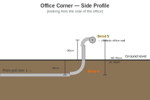
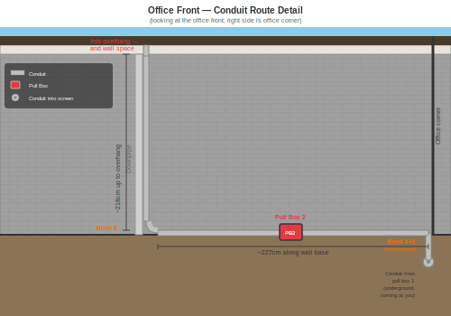

# Fibre to office planning

## Diagrams

> **Note:** All diagrams in this project are SVG and drawn to scale, where **1px = 1cm**.

### Property Layout Top View

**Key dimensions (all to-scale, 1px = 1cm):**

- Office: 365cm × 500cm (outside)
- Garage: 373cm × 500cm (outside)
- Wall space: 17cm × 500cm
- Office dirt bed: 78cm (below office, no soffit)
- Grass: 680cm × 619cm
- House: 1080cm × 1168cm
- Driveway (vertical): 301cm wide
- Paths: 80cm wide
- House soffit overhang: 50cm (within dirt bed)
- House dirt bed: 80cm (around house, includes soffit)

**Horizontal totals:**
- Office level: Garage(373) + Wall space(17) + Office(365) + Grass(680) + Vertical path(80) = 1515cm
- House level: Driveway(301) + House(1080) + Dirt bed(80) + Vertical path(80) = 1541cm

**Vertical total:**
- Office(500) + Dirt(78) + Grass(619) + H-path(80) + House dirt(80) + House(1168) = 2525cm

### Fibre Path Top View

**Cable route segments:**

- House inside (bare fibre): ~65cm up through wall into ceiling + ~560cm across roof space (to soffit hole)
- House downpipe (conduit): 275cm down alongside downpipe
- House ground to path (conduit, buried 30cm deep): ~186cm (26cm corner + 80cm dirt + 80cm path)
- Under path (conduit, buried below path base): ~80cm
- Alongside driveway edge (conduit, buried 30cm deep): ~667cm
- **Pull box 1** at corner where driveway meets horizontal path (weatherproof junction box, buried)
- Alongside horizontal path edge (conduit, buried 30cm deep): ~600cm
- Office corner (conduit, buried 60-70cm deep at corner): two sweep bends bring conduit from underground up to ground level and turn left along wall base
- Office front ground level (conduit, P-clipped to wall base): ~227cm along base of wall
- **Pull box 2** at ground level on office wall base (between corner bends and upward run)
- Office upward run (conduit, P-clipped to wall): up alongside downpipe into wall space/overhang
- Office wall space (bare fibre): 270cm down inside wall
- Office inside (bare fibre in trunking): 163cm ceiling to surface box
- **Total: ~3,500cm (~35m) + slack**

**Bends in the run (6 total):**

1. House downpipe base → into ground towards path (sweep bend)
2. Underground turn → parallel with horizontal path (sweep bend)
3. Turn towards office along driveway edge (sweep bend) — **pull box 1 here**
4. Underground → vertical at office corner (sweep bend)
5. Vertical → horizontal along office wall base (sweep bend)
6. Horizontal → vertical up alongside downpipe into wall space (sweep bend) — **pull box 2 before this bend**

Two pull boxes split the run into three segments for easy pulling:
- House soffit → pull box 1: 2 bends
- Pull box 1 → pull box 2: 2 bends
- Pull box 2 → office wall space: 1 bend

Use cable-pulling lubricant at each segment.

### House Inside Layout

**Key dimensions (fibre box wall profile):**

- Wall width shown: 203cm (bottom-right corner of house to fibre box)
- Floor to ceiling height: 244cm
- Fibre box: 17cm wide × 13cm high, 181cm from ceiling to top
- Heat pump: 50cm from fibre box, 78cm wide × 29cm high, 18cm from ceiling
- Cable wall entry point: aligned with fibre box, 10cm away

### House Inside Fibre Path

**Route:**

- Fibre comes through ceiling from soffit/wall space, drops down through brush plate 10cm to the right of the fibre box, plugs into media converter

#### Photos — House Inside

### House Downpipe Profile

**Key dimensions:**

- Wall height (ground to soffit): 275cm
- Downpipe to corner of house: 26cm
- Downpipe width: 7.5cm
- Soffit overhang: 50cm

### House Downpipe Fibre Path

**Conduit route:**

- Comes out of soffit, runs down the right side of the downpipe (in the 26cm gap), then along the wall at ground level

#### Photos — House Downpipe

### Office Front Layout

**Key dimensions (working right to left from office corner):**

- Office blockwork: 227cm wide, 325cm high at corner
- Door space: 104cm wide, 265cm high
- Wall space: 17cm wide
- Garage: 260cm wide (door width)
- Water drainage pipe: at 200cm height
- HP pipe: 72cm from right corner
- Heat pump: 62cm from right corner, 78cm wide

### Office Front Fibre Path

**Conduit route segments (right to left):**

- Along base of office wall from corner: ~227cm
- **Pull box 2** on wall base
- Up alongside downpipe into overhang/wall space: ~218cm
- Into wall space
- **Total front run: ~445cm**

### Office Corner Double Bend Detail

#### Side Profile (looking from the side)

Conduit comes horizontally underground from pull box 1, sweep bend 4 turns it upward, ~30cm straight section, then sweep bend 5 turns it towards the office wall (into the screen). Requires a deeper pit (~60-70cm) at this corner.

#### Front Profile (looking at the office front)

From the front, the conduit appears as a dot coming out of the ground at the office corner (bends 4+5 underground), runs horizontally along the base of the wall (~227cm), through pull box 2, then sweep bend 6 turns it vertical up alongside the downpipe (~218cm) straight into the overhang and wall space.

#### Photos — Office Front

### Office Inside Layout

**Key dimensions (wall space wall profile, door on left):**

- Wall shown: ~460cm wide, 215cm floor to ceiling
- Door to plug 1: 255cm
- Plug 1 to plug 2: 67cm
- Plug 2 to corner (going right): 70cm
- Vertical trunking up: 67cm
- Ceiling to power back box: 25cm
- All boxes: 12cm wide
- New fibre outlet: 10cm left of plug 1

### Office Inside Fibre Path

**Route:**

- Fibre comes through ceiling from wall space, drops 163cm straight down through brush plate (10cm left of plug 1), plugs into media converter/switch below

#### Photos — Office Inside

## To Purchase

### ✅ Ordered — PB Tech (arriving ~5 May)

| Item | Qty | Price (ex GST) |
|------|-----|-------|
| TP-Link MC220L Media Converter | 1 | $28.70 |
| MikroTik CSS106-5G-1S Switch (5× Ethernet + 1× SFP) | 1 | $92.99 |
| MikroTik S-31DLC20D SFP Module (Singlemode) | 2 | $48.70 ea |
| Cat6 Patch Lead 1m | 4 | $4.27 ea |
| Goldtool Fish Tape 30m | 1 | $42.61 |
| Delivery + surcharge | | $14.12 |
| **PB Tech total (inc GST)** | | **$336.83** |

### ✅ Ordered — FS.com (arriving ~1 May)

| Item | Qty | Price |
|------|-----|-------|
| Singlemode Fibre Cable 50m (LC-LC UPC, OS2 duplex) | 2 | $30.00 ea |
| **FS.com total** | | **$77.00** (incl. shipping) |

### ✅ Ordered — Bunnings (click & collect)

| Item | Qty | Price (inc GST) |
|------|-----|-------|
| Brush Plate Wall Cover | 2 | $10.71 ea |
| Mounting C-Clip/Bracket (plasterboard) | 1 | $3.32 |
| Weatherproof Pull Box (Deta 108×108×76mm Adaptable Box) | 1 | $17.70 |
| 20mm PVC Conduit Mounting Clips | 20 | $0.36 ea |
| Drywall/Jab Saw | 1 | $5.98 |
| Split Loom Tubing 3m (16mm) | 1 | $13.04 |
| **Bunnings order 1 total** | | **$68.66** |

### ✅ Ordered — Bunnings Airport (click & collect)

| Item | Qty | Price (inc GST) |
|------|-----|-------|
| 20mm Rigid Conduit (4m lengths) | 10 | $7.58 ea |
| 20mm Conduit Adaptors with Lock Ring | 2 | $0.48 ea |
| Polyester Pull String 80m | 1 | TBC |
| Polyfilla Gap Filler | 1 | TBC |
| **Bunnings Airport total** | | **TBC** |

### ✅ Ordered — Mitre 10 (delivery — couplers)

| Item | Qty | Price |
|------|-----|-------|
| 20mm Conduit Couplers/Joiners | 10 | $1.02 ea |
| Delivery fee | | $13.00 |
| **Mitre 10 couplers total** | | **$23.20** |

### ✅ Ordered — Mitre 10 (delivery — sweep bends)

| Item | Qty | Price |
|------|-----|-------|
| 20mm Conduit Sweep Bends | 5 | $6.28 ea |
| Delivery fee | | $8.00 |
| **Mitre 10 delivery total** | | **$39.40** |

### ✅ Ordered — Mitre 10 (click & collect)

| Item | Qty | Price |
|------|-----|-------|
| PVC Cement 125ml | 2 | $12.00 ea |
| Mini Trunking 25x16mm (3m) | 1 | $30.28 |
| Cable Clips 6-8mm (pack of 20) | 1 | $4.18 |
| Spade Bit Set 13-32mm (8 piece) | 1 | $24.99 |
| Mini Hacksaw 150mm | 1 | $9.98 |
| Silicone Sealant (clear) | 1 | $19.99 |
| **Mitre 10 click & collect total** | | **$113.42** |

### ✅ Already owned

| Item |
|------|
| Duct Tape |

### ❌ Still need to buy — Ideal Electrical (in-store)

| Item | Qty | Link |
|------|-----|------|
| 20mm Conduit Female Bush (uPVC) | 10 | [Marley 20mm Bush](https://www.ideal.co.nz/products/mar1820g) |
| CRC Wire Pulling Lubricant | 1 | [CRC Lubricant](https://www.ideal.co.nz/products/crc2053) |

### Spent so far: ~$744

### Estimated remaining (bushes + lube): ~$25

### Estimated Grand Total: ~$769

## Raw Measurements Reference

- House
  - Path along side — 500cm
  - Path to kitchen window — 450cm
  - Kitchen window to Browne box — 110cm
  - Ground to soffit — 275cm
  - From downpipe to path — 186cm
  - Downpipe to corner — 26cm
  - Downpipe width — 7.5cm
  - Soffit overhang — 50cm
  - Dirt bed depth — 80cm
- Path
  - Width — 80cm
  - Depth (into ground) — 10cm
- Grass
  - Along house — 690cm
  - To office — 645cm
- Office (outside)
  - Width (corner to wall space) — 365cm
  - Garage width (wall space to corner) — 260cm
  - Wall space width — 17cm
  - Height at corner — 325cm
  - Height above door — 265cm
  - Door space width — 104cm
  - Blockwork (corner to door space) — 227cm
  - Water drainage pipe height — 200cm
  - HP pipe from corner — 72cm
  - Heat pump from corner — 62cm
  - Heat pump width — 78cm
  - Overhang past door space — 15cm
  - Up to water pipes — 205cm
  - Up pipe to above door — 49cm
- Office (inside)
  - Wall space depth into room — 270cm
  - Width — 365cm
  - Depth — 500cm
  - Wall thickness — ~25cm
  - Floor to ceiling — 215cm
  - Ceiling to top of power box — 25cm
  - Ceiling to top of fibre outlet box — 163cm
- House (inside)
  - Floor to ceiling — 244cm
  - Corner to fibre box — 203cm
  - Fibre box width — 17cm
  - Fibre box height — 13cm
  - Ceiling to top of fibre box — 181cm
  - Fibre box to wall entry point — 10cm
  - Heat pump: 50cm from left edge of fibre box, 78cm wide, 29cm tall, 18cm from ceiling

---

## Diagram Technical Reference

These shape dimension tables are used for maintaining the to-scale SVG diagrams (1px = 1cm).

### Bird's-Eye View Shapes

| Shape | Width | Depth | Notes |
|-------|-------|-------|-------|
| Office | 365cm | 500cm | Outside measurement |
| Garage | 373cm | 500cm | Outside measurement |
| Wall Space | 17cm | 500cm | Between garage and office |
| Driveway (vertical) | 301cm | 2025cm | Runs from bottom of garage to bottom of house |
| Dirt (below office) | 365cm | 78cm | No soffit on office |
| Horizontal Path | 680cm | 80cm | Same width as grass |
| Vertical Path | 80cm | ~2525cm | Full height of diagram |
| Grass | 680cm | 619cm | Between office dirt and horizontal path |
| House | 1080cm | 1168cm | Sits between driveway and dirt bed |
| Soffit | 50cm | 50cm | Overhang around house, within dirt bed |
| Dirt (around house) | 80cm | 80cm | Top and right sides of house only. Left side flush with driveway, bottom is edge of diagram |

### Office Front Elevation Shapes

Working right to left from office corner. Diagram ends at garage door left edge.

| Shape | X from right | Width | Height | Notes |
|-------|-------------|-------|--------|-------|
| Office blockwork | 0 | 227cm | 325cm | Corner to door space edge |
| Heat pump | 62cm | 78cm | 55cm | On ground against wall |
| HP Pipe | 72cm | 8cm | 200cm | From ground up to water pipe |
| HP Pipe box | 72cm | 16cm | 14cm | Junction at top of pipe |
| Water drainage pipe | 72cm | 331cm | 8cm | HP pipe across to wall space (at 200cm height) |
| Downpipe (vertical) | 227cm | 10cm | 49cm | From water pipe up into roof |
| Door space | 227cm | 104cm | 265cm | Full door opening |
| Overhang hatch | 227cm | 120cm | 36cm | Above door, under roof |
| Wall space | 365cm | 17cm | 325cm | Between office and garage |
| Garage wall | 382cm | 260cm | 325cm | Only showing to door edge |
| Cream soffit | 0 | full | ~50cm | Strip above blockwork |
| Roof/fascia | 0 | full | ~15cm | Slopes up to garage peak |

### House Downpipe Profile Shapes

Front elevation looking at the house wall where the downpipe is. Right side is the corner of the house.

| Shape | X from corner (right) | Width | Height | Notes |
|-------|----------------------|-------|--------|-------|
| Wall (blockwork) | 0 | ~100cm shown | 275cm | House wall face section |
| Fascia/roof edge | 0 | full width | 12cm | Eaves edge above wall |
| Downpipe | 26cm | 7.5cm | ~271cm | From soffit down to shoe fitting |
| Pipe shoe fitting | ~30cm | 14cm | 8cm | Elbow/bend at pipe base |
| Pipe brackets | on pipe | 11.5cm | 2.5cm | Clips holding pipe to wall, ~70cm apart |
| Ground/dirt | 0 | full width | visible | Ground level at wall base |
| Corner edge | 0 | — | 275cm | Bold line marking house corner |

---

## Step-by-Step Installation

### Phase 1: Conduit Run (House to Office)

**What you're doing:** Installing the full conduit path from the house soffit to the office wall space. This includes the downpipe run, all underground trenches, the pull box, and the office wall run. By the end of this phase you'll have a continuous sealed pipe from house to office ready for the fibre pull.

**Tools needed:** Drill, 25mm spade bit, hacksaw, spade/shovel, tape measure, pencil, spirit level

**Parts needed:** 10× conduit (4m), 10× couplers, 6× sweep bends, 2× pull boxes, 4× pull box adaptors, 20× mounting clips, 10× conduit bushes, PVC cement, silicone sealant

**Steps:**

1. **Drill the soffit hole.** From outside, measure along the soffit to position the hole next to the downpipe (in the 26cm gap between pipe and corner). Drill up through the soffit with the 25mm spade bit.

2. **Run conduit down the downpipe.** Insert a conduit bush into the top of the first conduit length. Feed it up into the soffit hole. Run the conduit down the right side of the downpipe, P-clipping to the wall every ~60cm. Seal around the soffit hole with silicone.

3. **Attach sweep bend 1 at the downpipe base.** Glue a sweep bend to turn the conduit from vertical to horizontal, heading towards the path.

4. **Dig the trench to the horizontal path.** Dig a trench 30cm deep from the house corner, through the dirt bed, across/under the path (80cm), and alongside the horizontal path edge. Lay conduit as you go, gluing joints with PVC cement. Backfill each section once the conduit is in.

5. **Install sweep bend 2.** At the turn from the path crossing to the horizontal path, glue a sweep bend.

6. **Install pull box 1 at bend 3.** At the corner where the horizontal path meets the driveway edge, dig a hole for the pull box. Connect conduit to the pull box using the 20mm adaptors with lock rings — one on each side.

7. **Dig the trench alongside the driveway.** From pull box 1, dig a 30cm deep trench alongside the driveway edge through the grass, heading towards the office. Lay conduit, glue joints, backfill.

8. **Dig the deep pit at the office corner.** At the office corner, dig a pit 60-70cm deep (deeper than the trench) to accommodate two sweep bends stacked vertically.

9. **Install sweep bends 4 and 5 at the office corner.** Glue sweep bend 4 to turn the conduit from horizontal underground to vertical upward. Connect ~30cm of straight conduit, then glue sweep bend 5 to turn from vertical to horizontal along the wall base. Backfill the pit.

10. **Run conduit along the office wall base.** Run conduit horizontally along the base of the office wall (~227cm), P-clipping to the wall. 

11. **Install pull box 2.** Mount pull box 2 on the wall base along the horizontal run, connected with adaptors on each side.

12. **Install sweep bend 6 and run conduit up.** After pull box 2, glue sweep bend 6 to turn the conduit from horizontal to vertical. Run conduit up alongside the downpipe into the wall space/overhang, P-clipping to the wall every ~60cm.

13. **Cap both ends.** Tape over the open conduit ends (house soffit and office wall space) to keep out dirt and debris until you're ready for the fibre pull.

14. **Install conduit bushes.** Push conduit bushes into both open ends and at any exposed conduit termination points to protect the cable from sharp edges.

### Phase 2: Wall Work (Both Ends)

**What you're doing:** Preparing the inside of both the house and office so the fibre cable can pass from the conduit, through the wall cavities, and down to where the equipment will sit.

**Tools needed:** Jab saw, drill, 25mm spade bit, tape measure, pencil, spirit level, torch

**Parts needed:** 2× brush plates, 1× mounting C-clip/bracket, mini trunking

**House side:**

1. **Cut the brush plate hole.** Mark the brush plate position 10cm to the right of the fibre box, at the same height (181cm from ceiling). Drill a pilot hole to check the cavity is clear upwards. If clear, cut the hole with the jab saw.

2. **Drill through the top plate.** Go up to the roof space. Measure 213cm from the house corner along the wall (203cm to fibre box + 10cm to outlet). Drill down through the top plate with the 25mm spade bit.

3. **Confirm the path.** Push the fish tape down through the top plate hole. Have someone check it appears at the brush plate cutout below. If confirmed, the path is good.

4. **Mount the bracket and brush plate.** Push the C-clip/mounting bracket into the hole. Tighten until firm. Screw the brush plate onto the bracket.

5. **Plan the roof space route.** In the roof space, work out the path from the top plate hole to the soffit hole (~560cm). Follow joists/rafters where possible for neat clipping later.

**Office side:**

6. **Drill into the wall space from inside.** Measure the position for the fibre outlet (10cm left of plug 1, 163cm from ceiling). Drill a pilot hole to confirm the cavity is clear. Cut the hole with the jab saw.

7. **Mount the brush plate.** Attach the surface-mount brush plate at the hole.

8. **Install the trunking.** Run mini trunking from the brush plate down to where the switch will sit.

### Phase 3: Fibre Pull

**What you're doing:** Pulling both fibre cables through the entire conduit run, through the roof space, and down through the walls at each end.

**Tools needed:** Fish tape, pull string, cable pulling lubricant, duct tape, packing foam, torch

**Parts needed:** 2× fibre cables (50m), cable clips

**Steps:**

1. **Thread the fish tape.** Feed the fish tape through the conduit from the office wall space end, through the pull box, all the way to the house soffit end. This confirms the conduit path is clear.

2. **Attach the pull string.** Tie the nylon pull string to the fish tape at the office end. Pull the fish tape back from the house end, dragging the pull string through the entire conduit. You now have a string running the full length.

3. **Prepare the fibre cables.** Take both 50m fibre cables. Wrap the LC connectors at the leading end together in packing foam, tape into a smooth bullet shape with duct tape. This protects the connectors during the pull.

4. **Apply lubricant.** Squirt cable pulling lubricant into both ends of the conduit and along the first few metres of cable.

5. **Pull the cables.** Tie the pull string securely to the taped connector bundle. One person feeds cable in at the house soffit end while the other pulls the string gently from the office end. Go slow — never force it. At the pull box, you can open the lid to check progress and apply more lubricant if needed.

6. **Route through the house roof space.** Once the cable emerges from the soffit end, route it across the roof space (~560cm) following the planned path. Clip to joists/rafters with cable clips every ~50cm. Feed the cable down through the top plate hole.

7. **Feed cable through house wall.** The cable drops down through the wall cavity and out through the brush plate.

8. **Feed cable at office end.** The cable comes out of the conduit into the wall space, then down through the wall cavity and out through the brush plate/trunking.

9. **Leave service loops.** At both ends, leave ~1m of slack coiled behind the brush plate for future re-termination if needed.

### Phase 4: House Tidy Up & Connect

**What you're doing:** Connecting the house-end equipment and tidying up.

**Tools needed:** None

**Parts needed:** MC220L media converter, MikroTik SFP module, Cat6 patch lead

**Steps:**

1. **Insert the SFP module.** Slide the MikroTik S-31DLC20D into the MC220L's SFP slot until it clicks.

2. **Connect the fibre.** Plug one fibre cable's LC connector into the SFP module. (Keep the second cable coiled and tucked behind the brush plate as a spare.)

3. **Connect to router.** Plug the Cat6 patch lead from the MC220L's Ethernet port to a LAN port on your router.

4. **Power on.** Plug in the MC220L. The power light should come on. The fibre link light won't come on until the office end is connected.

5. **Tidy up.** Coil any excess fibre neatly behind the brush plate. Mount the MC220L on a shelf or bracket near the brush plate.

### Phase 5: Office Tidy Up & Connect

**What you're doing:** Connecting the office-end equipment, tidying up, and testing the full link.

**Tools needed:** None

**Parts needed:** MikroTik CSS106 switch, MikroTik SFP module, 3× Cat6 patch leads

**Steps:**

1. **Insert the SFP module.** Slide the MikroTik S-31DLC20D into the CSS106's SFP slot until it clicks.

2. **Connect the fibre.** Plug the fibre cable's LC connector into the SFP module. (Keep the second cable as a spare.)

3. **Power on the switch.** Plug in the CSS106. The power light should come on. Check the SFP port light — it should show link activity if the house end is also powered on.

4. **Connect your devices.** Plug Cat6 patch leads from the CSS106's Ethernet ports to your office devices (computer, monitor, etc).

5. **Test the connection.** From your office computer, check you can reach the internet and your home network. Run a speed test to confirm you're getting full gigabit throughput.

6. **Tidy up.** Coil excess fibre behind the brush plate. Mount the CSS106 on a shelf or bracket below the brush plate. Secure trunking to the wall.

7. **Done!** 🎉 You now have a dedicated gigabit fibre link from your house to your office.
